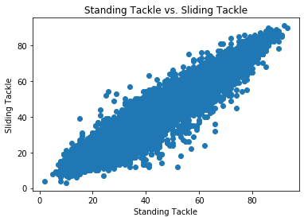

## Data Visualization

In this checkpoint you will be using a FIFA dataset of soccer player statistics to create a visualization, then also interpreting a visualization we have created.


```python
# Run this cell without changes
import pandas as pd
import matplotlib.pyplot as plt
import seaborn as sns
%matplotlib inline
```


```python
# __SOLUTION__
import pandas as pd
import matplotlib.pyplot as plt
import seaborn as sns
%matplotlib inline
```


```python
# Run this cell without changes
df = pd.read_csv('./data/fifa.csv')
df.head()
```


```python
# __SOLUTION__
df = pd.read_csv('./data/fifa.csv')
df.head()
```


<div>
<style scoped>
    .dataframe tbody tr th:only-of-type {
        vertical-align: middle;
    }

    .dataframe tbody tr th {
        vertical-align: top;
    }

    .dataframe thead th {
        text-align: right;
    }
</style>
<table border="1" class="dataframe">
  <thead>
    <tr style="text-align: right;">
      <th></th>
      <th>ID</th>
      <th>Name</th>
      <th>Age</th>
      <th>Photo</th>
      <th>Nationality</th>
      <th>Flag</th>
      <th>Overall</th>
      <th>Potential</th>
      <th>Club</th>
      <th>Club Logo</th>
      <th>...</th>
      <th>Composure</th>
      <th>Marking</th>
      <th>StandingTackle</th>
      <th>SlidingTackle</th>
      <th>GKDiving</th>
      <th>GKHandling</th>
      <th>GKKicking</th>
      <th>GKPositioning</th>
      <th>GKReflexes</th>
      <th>Release Clause</th>
    </tr>
  </thead>
  <tbody>
    <tr>
      <th>0</th>
      <td>158023</td>
      <td>L. Messi</td>
      <td>31</td>
      <td>https://cdn.sofifa.org/players/4/19/158023.png</td>
      <td>Argentina</td>
      <td>https://cdn.sofifa.org/flags/52.png</td>
      <td>94</td>
      <td>94</td>
      <td>FC Barcelona</td>
      <td>https://cdn.sofifa.org/teams/2/light/241.png</td>
      <td>...</td>
      <td>96.0</td>
      <td>33.0</td>
      <td>28.0</td>
      <td>26.0</td>
      <td>6.0</td>
      <td>11.0</td>
      <td>15.0</td>
      <td>14.0</td>
      <td>8.0</td>
      <td>226500.0</td>
    </tr>
    <tr>
      <th>1</th>
      <td>20801</td>
      <td>Cristiano Ronaldo</td>
      <td>33</td>
      <td>https://cdn.sofifa.org/players/4/19/20801.png</td>
      <td>Portugal</td>
      <td>https://cdn.sofifa.org/flags/38.png</td>
      <td>94</td>
      <td>94</td>
      <td>Juventus</td>
      <td>https://cdn.sofifa.org/teams/2/light/45.png</td>
      <td>...</td>
      <td>95.0</td>
      <td>28.0</td>
      <td>31.0</td>
      <td>23.0</td>
      <td>7.0</td>
      <td>11.0</td>
      <td>15.0</td>
      <td>14.0</td>
      <td>11.0</td>
      <td>127100.0</td>
    </tr>
    <tr>
      <th>2</th>
      <td>190871</td>
      <td>Neymar Jr</td>
      <td>26</td>
      <td>https://cdn.sofifa.org/players/4/19/190871.png</td>
      <td>Brazil</td>
      <td>https://cdn.sofifa.org/flags/54.png</td>
      <td>92</td>
      <td>93</td>
      <td>Paris Saint-Germain</td>
      <td>https://cdn.sofifa.org/teams/2/light/73.png</td>
      <td>...</td>
      <td>94.0</td>
      <td>27.0</td>
      <td>24.0</td>
      <td>33.0</td>
      <td>9.0</td>
      <td>9.0</td>
      <td>15.0</td>
      <td>15.0</td>
      <td>11.0</td>
      <td>228100.0</td>
    </tr>
    <tr>
      <th>3</th>
      <td>193080</td>
      <td>De Gea</td>
      <td>27</td>
      <td>https://cdn.sofifa.org/players/4/19/193080.png</td>
      <td>Spain</td>
      <td>https://cdn.sofifa.org/flags/45.png</td>
      <td>91</td>
      <td>93</td>
      <td>Manchester United</td>
      <td>https://cdn.sofifa.org/teams/2/light/11.png</td>
      <td>...</td>
      <td>68.0</td>
      <td>15.0</td>
      <td>21.0</td>
      <td>13.0</td>
      <td>90.0</td>
      <td>85.0</td>
      <td>87.0</td>
      <td>88.0</td>
      <td>94.0</td>
      <td>138600.0</td>
    </tr>
    <tr>
      <th>4</th>
      <td>192985</td>
      <td>K. De Bruyne</td>
      <td>27</td>
      <td>https://cdn.sofifa.org/players/4/19/192985.png</td>
      <td>Belgium</td>
      <td>https://cdn.sofifa.org/flags/7.png</td>
      <td>91</td>
      <td>92</td>
      <td>Manchester City</td>
      <td>https://cdn.sofifa.org/teams/2/light/10.png</td>
      <td>...</td>
      <td>88.0</td>
      <td>68.0</td>
      <td>58.0</td>
      <td>51.0</td>
      <td>15.0</td>
      <td>13.0</td>
      <td>5.0</td>
      <td>10.0</td>
      <td>13.0</td>
      <td>196400.0</td>
    </tr>
  </tbody>
</table>
<p>5 rows × 88 columns</p>
</div>


**1) Find the top 10 countries with the most players (using the 'Nationality' column). Create a bar chart showing the number of players in those 10 countries**

Don't forget to add a **title** and **x axis label** to your charts.

If you are unable to find the top 10 countries but want the chance to demonstrate your plotting skills use the following dummy data to create a bar chart
```
Country Name  | Num Players
============  | ===========
Country A     | 100
Country B     | 60
Country C     | 125
Country D     | 89
```


```python
# Code here to get the top 10 countries with the most players

```


```python
# __SOLUTION__ 
top_10 = df.Nationality.value_counts()[0:10]
top_10.index
```


    Index(['England', 'Germany', 'Spain', 'France', 'Argentina', 'Brazil', 'Italy',
           'Colombia', 'Japan', 'Netherlands'],
          dtype='object')


```python
# Code here to plot a bar chart.  A recommended figsize is (10, 6)

```


```python
# __SOLUTION__ 
fig, ax = plt.subplots(figsize=(10, 6))

ax.set_title("10 Countries with the Most Players")
ax.set_ylabel("Number of Players")

labels = list(top_10.index)
values = list(top_10.values)
ax.bar(labels, values)
```


    <BarContainer object of 10 artists>


**2) Below is code for a scatter plot for the player stats `StandingTackle` and `SlidingTackle`**


```python
# Run this cell without changes
fig, ax = plt.subplots()

ax.set_title('Standing Tackle vs. Sliding Tackle')
ax.set_xlabel('Standing Tackle')
ax.set_ylabel('Sliding Tackle')

x = df['StandingTackle']
y = df['SlidingTackle']

ax.scatter(x, y)
```


```python
# __SOLUTION__ 
fig, ax = plt.subplots()

ax.set_title('Standing Tackle vs. Sliding Tackle')
ax.set_xlabel('Standing Tackle')
ax.set_ylabel('Sliding Tackle')

x = df['StandingTackle']
y = df['SlidingTackle']

ax.scatter(x, y)
```


    <matplotlib.collections.PathCollection at 0x10e6e76d8>





**How would you describe the relationship between these two features?**


```python
# Your written answer here
```


```python
# __SOLUTION__
# These two features are highly correlated.
```
